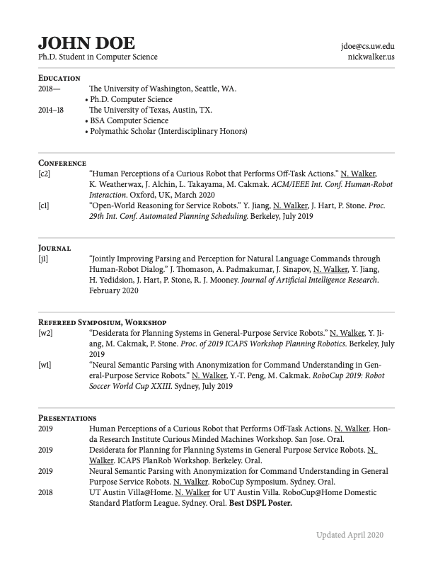

# InDesign CV Template

A neatly-set CV with scripts for painless updates. Probably good as a resume template too.

* ExtendScript (Adobe's Javascript) for loading details from a json file
* Automated BibTex import for publications

You can see my CV for [a customized use case](https://nickwalker.us/cv).

## Preparation

**The script and template are a starting point. You'll need to tweak them to your needs!**

Format your CV into a json file. If you have your publications in a .bib file, you can use the Python script to dump this information into the publications field automatically. For the rest of the fields, see the example. The schema is an extension of [JSON Resume](https://jsonresume.org/schema/).

* Reorder sections by changing the order in `main()` in the script.

* The script is responsible for getting characters in the document and accomplishes most of the formatting using Paragraph Styles. Most cosmetic customization can be accomplished by tweaking these styles.

## Installation

Once you have a version of the script you're happy to use, move it to [the InDesign scripts folder](https://www.danrodney.com/scripts/directions-installingscripts.html). On macOS, this is `~/Library/Preferences/Adobe Indesign/<version>/<language>/Scripts/Scripts Panel/`.

Finally, place a copy of "json2.js" from [JSON-js](https://github.com/douglascrockford/JSON-js) in the same folder.

## Usage

To populate the InDesign document with the JSON data:

* Open the template InDesign document (or any .indd that has the appropriate Paragraph/Character styles).
* Select a spot in the main text frame. Everything in this frame will be replaced.
* Trigger the script from the Scripts panel

Make sure you export the PDF with "Interactive" and "Export Tags" checked so that links work, and so [your document is accessible](https://www.adobe.com/content/dam/acom/en/products/indesign/pdfs/creating-accessible-pdf-documentw-with-adobe-indesign-cs6-v3.pdf).